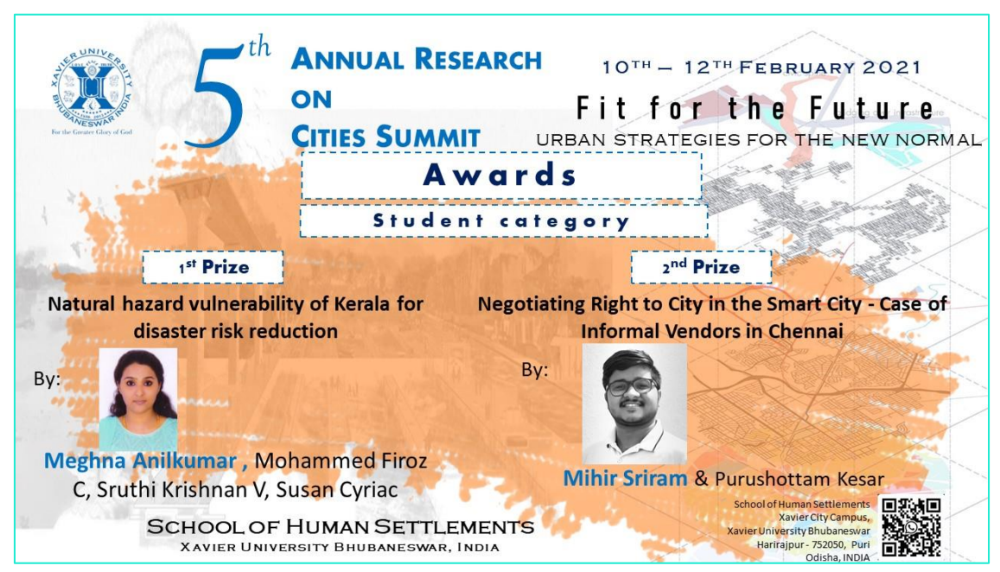

## 2025

## 2024

## 2023

## 2022
### Runner up - Friends of Transit
- [In the news- ASU planning and sustainability students receive top awards for transportation innovations](https://www.google.com/url?sa=t&rct=j&q=&esrc=s&source=web&cd=&ved=2ahUKEwjAjvXo9bqLAxWkI0QIHWqXFggQFnoECAYQAQ&url=https%3A%2F%2Fnews.asu.edu%2F20220304-asu-planning-and-sustainability-students-receive-top-awards-transportation-innovations&usg=AOvVaw1MK87YHm0f6nNQznqJeXhy&opi=89978449)

###

## 2021

### Runner up - 
- [In the news - 5th Annual Research on Cities Summit 2021](https://shs.xim.edu.in/wp-content/uploads/2021/02/ARCS-5.0-Report.pdf)

## 2020

### Winner - Architecture Essay Writing Competition

- [In the news - Winners Announced For The Architectural Essay Writing Competition 2020 Conducted By IDHA Labs](https://thearchitectsdiary.com/winners-announced-for-the-architectural-essay-writing-competition-2020-conducted-by-idha-labs/)

### Xavier University Bhubhaneshwar 